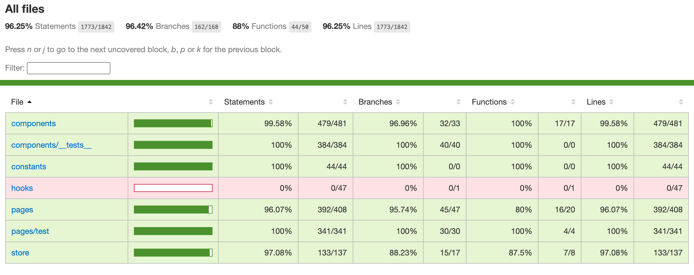

# E-commerce Application

This is a modern e-commerce application built with React, React Router DOM, React Query, Redux Toolkit, and includes features like pagination, search, and filter.

## Technologies Used

- **React**: used for creating UI interfaces.
- **React Router DOM**: Used for navigation between components.
- **React Query**: Hooks for fetching, caching, and updating asynchronous data in React.
- **Redux Toolkit**: Used for state management.
- **Pagination**: Implemented to navigate through product listings.
- **Search**: Allows users to search for products.
- **Filter**: Enables users to filter products based on categories and other criteria.

## Features

- **Product Listing**: Browse through a list of products with pagination.
- **Product Search**: Search for products using keywords.
- **Product Filter**: Filter products by categories, price, and other attributes.
- **Product Details**: View detailed information about a product.
- **Cart Management**: Add, remove, and manage products in the shopping cart.
- **Favorites**: Mark products as favorites for quick access.

## Test Coverage

This project has 96% test coverage using React Testing Library.

